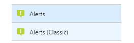

![gablogo][gablogo]

# Explore monitoring and troubleshooting with Azure Monitor

Azure Monitor is a landing page that helps users to have a better visibility into the performance, health and states of Azure resources. 

During this session, you will learn how to use Azure Monitor to perform troubleshooting. You will understand how Azure Monitor can help you to have a better visibility into anything that can impact your app availability and performance. 

We will show you how you can use Azure monitor to stay on top of things by generating notifications when a degradation happens. Because no matter what you do, it always happens.

## Inside Azure Monitor

At the heart of Azure Monitor is a telemetry pipeline that connects to your Azure services.  And there are over 30 services that you can pull data from now. And the list keeps growing.

Azure Monitor has 3 categories of monitoring data: 

* Activity logs
* Diagnostic logs
* Metrics

## Activity Logs
The Azure Activity Log is a subscription log that provides insight into subscription-level events that have occurred in Azure.  Using the Activity Log, you can determine the ‘what, who, and when’ for any write operations (PUT, POST, DELETE) taken on the resources in your subscription.

The Azure Activity Log is primarily for activities that occur in Azure Resource Manager. It does not track resources using the Classic model. 

You can retrieve events from your Activity Log using the Azure portal, CLI, PowerShell cmdlets, and Azure Monitor REST API.

### LAB 1 - Who scale your app service plan?

**Prerequisite:** Change you app service plan from Free tier to D1 Shared

**Scenario**: You are reviewing your Azure subscription bill like you do every month but this time you're saw a sudden increase of your  subscription total. Someone scaled up your service plan from a Free tier to a D1 Shared but you just don't recall that you've made that change.

**Goal:** Identify who made that change

* Step 1 : Go on Azure portal and choose the Azure Monitor landing page
* Step 2: Select Activity log the navigation pan
* Step 3: Use the filter to search changes that occured during the last month for you service plan.
* Step 4: Observe :  You're getting old! You're the one who made that change.

## Alerts

Alert allows you to get notified and take action against a specific event.

You can set alerts on your metrics to keep check on the health and performance of your resources.

Alerts experience in Azure has a fresh look and updated functionality. This new experience is available from the Alerts tab under Azure Monitor. The following are some of the advantages of using the new Alerts experience compared to Alerts (Classic) experience:

* Separation of Fired alerts and Alert Rules - In the new Alerts experience, Alert Rules (the definition of condition that triggers an alert), and Fired Alerts (an instance of the alert rule firing) are differentiated, so the operational and configuration views are separated.
* A unified authoring experience for metric, activity log and log alerts - The new Alerts authoring experience guides the user along the process of configuring an alert rule, which makes it simpler to discover the right things to get alerted on.
* View fired Log Analytics alerts in Azure portal - In the Alerts experience, you can now also see fired Log Analytics alerts in your subscription.

In other word, no need to use Azure Alert Classic

### LAB 2 - Generate an alert when you app service plan is updated?

**Scenario**: In the previous lab we saw how it easy using the activity log to monitor changes in our Azure resources. 

**Goal:** Generate a new alert when your service plan is updated.

* Step 1: ...
* Step 2: ...
* Step 3: ...

### Metrics

Right of the bat, metrics (telemetry data \ performance counters) are already configured. Just wait a few minutes after creating your virtual machines and you should see available metrics that you wish to display. That is it. No cost. No configuration, but a limited range of metrics by default.  

Metrics are:

* Collected at one minute frequency
* Available immediately
* Retained for 30 days

## Metrics (Preview)

### LAB 3 - *********

**Scenario**: ....

**Goal:** ....

* Step 1: ...
* Step 2: ...
* Step 3: ...

## Diagnostics Logs
What can we do if we need additional performance data? E.g. memory. 

## Service Health

Service Health is your personalized dashboard in the Azure Portal for receiving notifications when Azure service issues, update or planned maintenance that could affect your resources

### Get smarter alerts with Logic App

You should receive two emails alert when a metric reach it's configured limit. One when it's get activated and another one when the metric is back under normal value. Receiving too many emails for alerts can be annoying and also the basic email alert template doesnt tell you much information on the current situation.

### Routing your logs
If you want to route for depeer analytics of your log, you can select your preferred way by customizing the diagnostics settings.  You can stream monitoring data to other locations.

Examples include:

* Send to Application Insights so you can use its richer visualization and analysis tools.
* Send to Event Hubs so you can route to third-party tools.

### Store and Archive
Some monitoring data is already stored and available in Azure Monitor for a set amount of time.

* Metrics are stored for 30 days.
* Activity log entries are stored for 90 days.
* Diagnostics logs are not stored at all.

### Visualize
Visualizing your monitoring data in graphics and charts helps you find trends quicker than looking through the data itself.

A few visualization methods include:

* Use the Azure portal
* Route data to Azure Application Insights
* Route data to Microsoft PowerBI
* Route the data to a third-party visualization tool using either live streaming or by having the tool read from an archive in Azure storage

### Pin to your Dashboard
You can create multiple dashboards and share them with others who have access to your Azure subscriptions. 

### Reference
* [Overview of Azure Monitor](https://docs.microsoft.com/en-us/azure/monitoring-and-diagnostics/monitoring-overview-azure-monitor)
* [View activity logs to audit actions on resources](https://docs.microsoft.com/en-us/azure/azure-resource-manager/resource-group-audit)

* [Create and share dashboards in the Azure portal](https://docs.microsoft.com/en-us/azure/azure-portal/azure-portal-dashboards)
* [The next generation of Azure Alerts has arrived](https://azure.microsoft.com/en-us/blog/the-next-generation-of-azure-alerts-has-arrived/)
* [Azure Monitor–General availability of multi-dimensional metrics APIs](https://azure.microsoft.com/en-us/blog/azure-monitor-general-availability-of-multi-dimensional-metrics-apis/)
* [Supported metrics with Azure Monitor](https://docs.microsoft.com/en-us/azure/monitoring-and-diagnostics/monitoring-supported-metrics)
* [Monitor Subscription Activity with the Azure Activity Log](https://docs.microsoft.com/en-us/azure/monitoring-and-diagnostics/monitoring-overview-activity-logs)
* [Azure Monitor Pricing](https://azure.microsoft.com/en-us/pricing/details/monitor/)
* [Azure diagnostic logs](https://docs.microsoft.com/en-us/azure/cdn/cdn-azure-diagnostic-logs)

[gablogo]: ../media/logo-2018-500x444.png "Global Azure Bootcamp logo"
