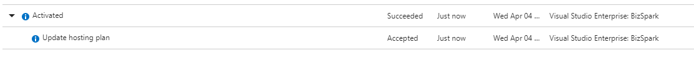
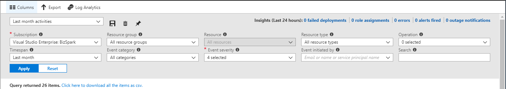
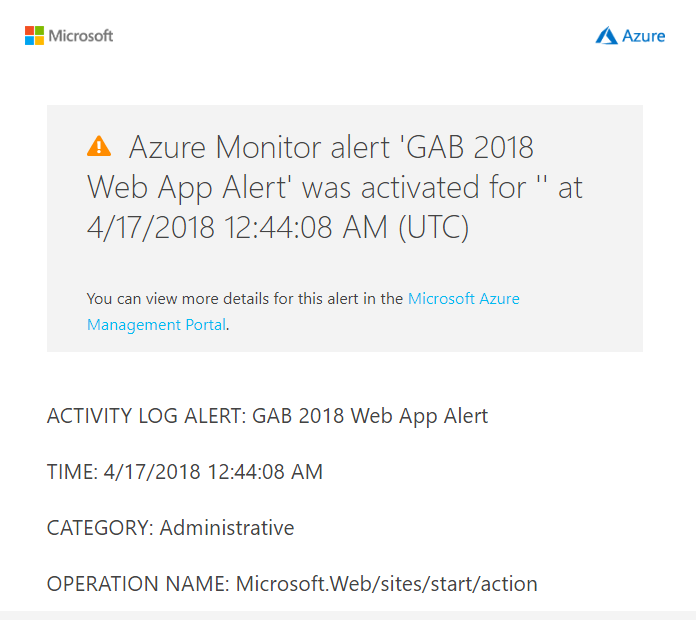

![gablogo][gablogo]

# Explore monitoring and troubleshooting with Azure Monitor

Azure Monitor is a landing page that helps users to have a better visibility into the performance, health and states of Azure resources.

During this session, you will learn how to use Azure Monitor to perform troubleshooting. You will understand how Azure Monitor can help you to have a better visibility into anything that can impact your app availability and performance.

We will show you how you can use Azure monitor to stay on top of things by generating notifications when a degradation happens. Because no matter what you do, it always happens.

## Inside Azure Monitor

Azure monitor has been around for a while now. Before this, existing services were implementing their own method of capturing and displaying metrics. Some services were better than others and there was a very inconsistent approach. Azure Monitor was created as a means to provide a consistent way for resources (both IaaS and PaaS) to collect metrics and provide access to them.

Azure monitor on its own provides a great solution if you are looking for either point in time, or short time scale metrics for a single resource. If you're having an issue with a web app and you want to go and look at its performance metrics, you can do this through Azure Monitor using the portal and see some great charts about what is happening now.

Where this falls down is where you want to be able to monitor multiple resources. If you want to look across your estate of 100 web apps and determine which is using the most memory then this is going to be a very arduous task working with each site individually. This where Log Analytics comes handy as we saw in the previous step.

At the heart of Azure Monitor is a telemetry pipeline that connects to your Azure services. And there are over 30 services that you can pull data from now. And the list keeps growing.

Azure Monitor has 3 categories of monitoring data:

* Activity logs
* Diagnostic logs
* Metrics

## Activity Logs

The Azure Activity Log is a subscription log that provides insight into subscription-level events that have occurred in Azure. Using the Activity Log, you can determine the ‘what, who, and when’ for any write operations taken on the resources in your subscription.

The Azure Activity Log is primarily for activities that occur in Azure Resource Manager. It does not track resources using the Classic model.

You can retrieve events from your Activity Log using the Azure portal, CLI, PowerShell cmdlets, and Azure Monitor REST API.

The Activity Log contains several categories of data:

* **Administrative** - This category contains the record of all create, update, delete, and action operations performed through Resource Manager. Examples of the types of events you would see in this category include "create virtual machine" and "delete network security group".

* **Service Health** - This category contains the record of any service health incidents that have occurred in Azure. An example of the type of event you would see in this category is "SQL Azure in East US is experiencing downtime." Service health events come in five varieties: Action Required, Assisted Recovery, Incident, Maintenance, Information, or Security, and only appear if you have a resource in the subscription that would be impacted by the event.

* **Alert** - This category contains the record of all activations of Azure alerts. An example of the type of event you would see in this category is "CPU % on myVM has been over 80 for the past 5 minutes."

* **Autoscale** - This category contains the record of any events related to the operation of the autoscale engine based on any autoscale settings you have defined in your subscription. An example of the type of event you would see in this category is "Autoscale scale up action failed."

* **Recommendation** - This category contains recommendation events from certain resource types, such as web sites and SQL servers. These events offer recommendations for how to better utilize your resources. You only receive events of this type if you have resources that emit recommendations.

* **Security** - This category contains the record of any alerts generated by Azure Security Center. An example of the type of event you would see in this category is "Failed login for the user".

### What can you do with Activity log

* Query and view it in the ***Azure portal***.
* Create an alert on an Activity Log event.
* Stream it to an ***Event Hub*** for ingestion by a third-party service or custom analytics solution such as PowerBI.
* Analyze it in PowerBI using the ***PowerBI content pack***.
* Save it to a ***Storage Account*** for archival or manual inspection. You can specify the retention time (in days) using the Log Profile.
* Query it via PowerShell Cmdlet, CLI, or REST API.

### LAB 1 - Who scale your app service plan ( 5 minutes)

**Prerequisite:** Change your app service plan from Free tier to D1 Shared

**Scenario**: You are reviewing your Azure subscription bill like you do every month but this time you're seeing a sudden increase of your subscription total. Someone scaled up your service plan from a Free tier to a D1 Shared but you just don't recall that you've made that change.

**Goal:** Query the Activity Log using the Azure portal

* Step 1 : Go on Azure portal and choose the Azure Monitor landing page
* Step 2: Select Activity log the navigation pan
* Step 3: Set your filter to identify your service plan then apply
* Step 4: Observe : A scale was done on [date] by [user].

Take two minutes to understand what are the available fitlers an options.

* Save queries
* Export result as CSV
* Export your activity logs to a storage or Event hub
* Export to Log Analytics for a more inteligent search capabilities ( see [Getting Started with Queries](https://docs.loganalytics.io/docs/Learn/Cheat-sheets/Legacy-to-new-to-Azure-Log-Analytics-Language))
* Add an activity log alert directly from a result set
* Pin your saved query to the a dashboard

## Alerts

You can receive an alert based on monitoring metrics for, or events on, your Azure services.

* **Metric values** - The alert triggers when the value of a specified metric crosses a threshold you assign in either direction. That is, it triggers both when the condition is first met and then afterwards when that condition is no longer being met.
* **Activity log events** - An alert can be trigger on every event, or, only when certain event occurs.

You can configure a classic metric alert to do the following when it triggers:

* Send email notifications to the service administrator and co-administrators
* Send email to additional emails that you specify.
* Call a webhook
* Start execution of an Azure runbook (only from the Azure portal)

Azure Monitor now supports a new metric alert type. The newer alerts differ from classic metric alerts in a few ways:

* **Improved latency**: Newer metric alerts can run as frequently as every one minute. Older metric alerts always run at a frequency of 5 minutes. Log alerts still have a longer than 1 minute delay due to the time is taken to ingest the logs.
* **Support for multi-dimensional metrics**: You can alert on dimensional metrics allowing you to monitor on only an interesting segment of the metric.
* **More control over metric conditions**: You can define richer alert rules. The newer alerts support monitoring the maximum, minimum, average, and total values of metrics.
* **Combined monitoring of multiple metrics**: You can monitor multiple metrics (currently, up to two metrics) with a single rule. An alert is triggered if both metrics breach their respective thresholds for the specified time-period.
* **Better notification system**: All newer alerts use action groups, which are named groups of notifications and actions that can be reused in multiple alerts. Classic metric alerts and older Log Analytics alerts do not use action groups.
* **Metrics from Logs (limited public preview)**: Log data going into Log Analytics can now be extracted and converted into Azure Monitor metrics and then alerted on just like other metrics.

### LAB 2 - Generate an alert when you app service plan is updated.

**Scenario**: In the previous lab we saw how easy it is to use the activity log to monitor changes in our Azure resources. Let's now generate an Alert when an update is done to your app service plan.

**Goal:** Generate a new alert when your service plan is updated.

* Step 1: From the navigation pane in Azure Monitor, select ***Alert***
* Step 2: Using the top menu, click ***+ New Alert Rule***
* Step 3: Select your app Service Plan as the target of your alert.
* Step 4: Use ***Create or Update App Service Plan*** as criteria.
* Step 5: Type a name, a description and a severity for your alert. ex: ***GAB 2018 App service plan updates*** and ***A change has been made to your service plan***, ***Severity 3***
* Step 6: Use the Action Group generated in the previous step ( or create a new one)
* Step 7: Review your alert definition and save. Note: Alert could take around 5 minutes to be activated.
* Step 8: Let's now change your App Service Plan back to Free tier.

This last step should generate an alert to your action group.

## Metrics

All Azure services track key metrics that allow you to monitor the health, performance, availability and usage of your services.
Right of the bat, metrics (telemetry data \ performance counters) are already configured, but for some services, you may need to turn on diagnostics in order to see any metrics. 

Metrics have the following characteristics:

* All metrics have one-minute frequency (unless specified otherwise in a metric's definition). You receive a metric value every minute from your resource, giving you near real-time visibility into the state and health of your resource.
* Metrics are available immediately. You don't need to opt in or set up additional diagnostics.
* You can access 93 days of history for each metric. You can quickly look at the recent and monthly trends in the performance or health of your resource.
* Some metrics can have name-value pair attributes called dimensions. These enable you to further segment and explore a metric in a more meaningful way.

## Diagnostics Settings

Resource diagnostic logs for non-Compute resources are configured using resource diagnostic settings.

* Where resource diagnostic logs and metrics are sent (Storage Account, Event Hubs, and/or OMS Log Analytics).
* Which log categories are sent and whether metric data is also sent.
* How long each log category should be retained in a storage account
* A retention of zero days means logs are kept forever. Otherwise, the value can be any number of days between 1 and 2147483647.
* If retention policies are set but storing logs in a Storage Account is disabled (for example, if only Event Hubs or OMS options are selected), the retention policies have no effect.
* Retention policies are applied per-day, so at the end of a day (UTC), logs from the day that is now beyond the retention policy are deleted. For example, if you had a retention policy of one day, at the beginning of the day today the logs from the day before yesterday would be deleted.

## Service Health

Service Health is your personalized dashboard in the Azure Portal for receiving notifications when Azure service issues, update or planned maintenance that could affect your resources.

### LAB 2 - Get smarter alerts with Logic App

**Scenario**:You should receive two emails alert when a metric reach it's configured limits. One when it gets activated and another one when the metric is back under normal value. Receiving too many emails for alerts can be annoying and also the basic email alert template doesn't tell you much information on the current situation.

**Goal:** Generate a smarter alert email with Logic App

* Step 1 : Create a Logic App

* Click the Create a resource button found on the upper left-hand corner of the Azure portal.
* Search for and select Logic App. Click the Create button.
* Enter the name myLogicApp and select your existing Resource Group. Use your subscription. Use the default location. Check the Pin to Dashboard option. When complete, click Create. 

* The logic app should be pinned to your dashboard. Navigate to the logic app by clicking on it.

* Step 2: Design Your Logic App

* In the Logic App panel, select the Logic App Designer. 
* Step 3: ...
* Step 4: ...

### Routing your logs

If you want to route your log for deeper analytics, you can select your preferred way by customizing the diagnostics settings. You can stream monitoring data to other locations.

Examples include:

* Send to Application Insights so you can use its richer visualization and analysis tools.
* Send to Event Hubs so you can route to third-party tools.

## Archive

You can archive metrics to storage for longer retention or use them for offline reporting. You can route your metrics to Azure Blob storage when you configure diagnostic settings for your resource.

## Pin to your Dashboard

You can create multiple dashboards and share them with others who have access to your Azure subscriptions. 

## Reference
* [Monitoring Overview](https://docs.microsoft.com/en-us/azure/monitoring-and-diagnostics/monitoring-overview)
* [Overview of Azure Monitor](https://docs.microsoft.com/en-us/azure/monitoring-and-diagnostics/monitoring-overview-azure-monitor)
* [View activity logs to audit actions on resources](https://docs.microsoft.com/en-us/azure/azure-resource-manager/resource-group-audit)

* [Create and share dashboards in the Azure portal](https://docs.microsoft.com/en-us/azure/azure-portal/azure-portal-dashboards)
* [The next generation of Azure Alerts has arrived](https://azure.microsoft.com/en-us/blog/the-next-generation-of-azure-alerts-has-arrived/)
* [Azure Monitor–General availability of multi-dimensional metrics APIs](https://azure.microsoft.com/en-us/blog/azure-monitor-general-availability-of-multi-dimensional-metrics-apis/)
* [Supported metrics with Azure Monitor](https://docs.microsoft.com/en-us/azure/monitoring-and-diagnostics/monitoring-supported-metrics)
* [Monitor Subscription Activity with the Azure Activity Log](https://docs.microsoft.com/en-us/azure/monitoring-and-diagnostics/monitoring-overview-activity-logs)
* [Azure Monitor Pricing](https://azure.microsoft.com/en-us/pricing/details/monitor/)
* [Azure diagnostic logs](https://docs.microsoft.com/en-us/azure/cdn/cdn-azure-diagnostic-logs)

[gablogo]: ../media/logo-2018-500x444.png "Global Azure Bootcamp logo"